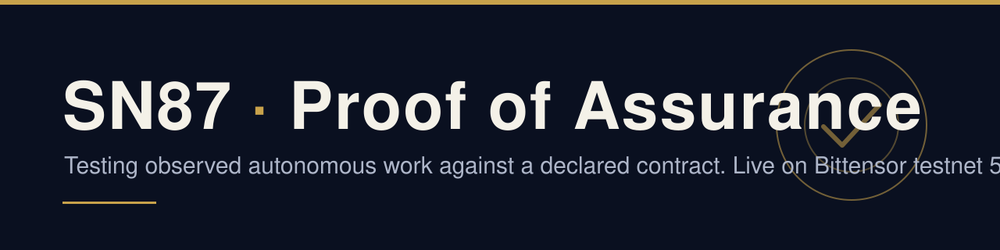
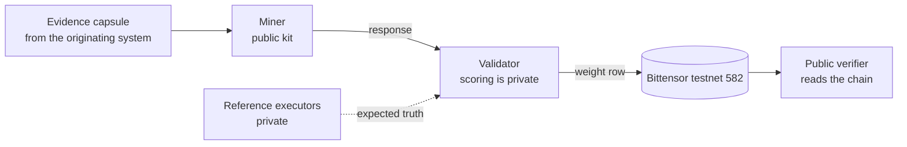

<p align="center"></p>

<p align="center">
  <a href="https://github.com/provenonce-ai/sn87-provenonce-public/actions/workflows/conformance.yml"></a>
  <a href="LICENSE"></a>
  
  
</p>

**The run succeeded. Was it right?**

SN87 is a Bittensor subnet where miners test the difference between observed autonomous work and
a declared assurance contract, for eligible structured workflows and their evidence. This is
Proof of Assurance: each miner returns one Differential, and a validator checks it.

Provenonce and Bitstarter.ai are partnering on Proof of Assurance (Bittensor Subnet 87).
Site: <https://provenonce.ai/sn87/>. Whitepaper: <https://provenonce.ai/sn87/whitepaper/>.

## Work in public

SN87 is live on Bittensor testnet 582 since 4 October 2026 (US Pacific); the first attested
weight-set landed at block 8,152,574, and weight-sets keep landing on chain. The code is open under the MIT License, and anyone can check the chain proof themselves
with the public verifier below.

## 60-second quickstart

Python 3.12+ and [uv](https://docs.astral.sh/uv/) are the only requirements.

```bash
git clone https://github.com/provenonce-ai/sn87-provenonce-public && cd sn87-provenonce-public
uv sync --locked --extra transport
uv run sn87-provenonce demo
```

The demo runs offline on synthetic data and prints a `FINDINGS` response. To check the chain
proof, run the verifier (next section). To serve a miner, see [Run a miner](#run-a-miner).

## Verify the chain proof yourself

[attestation/](attestation) holds two self-digested lists of completed testnet runs (no
signatures, no keys; 21 runs in the current one): for each, the block in which the validator set
weights on netuid 582 and the row it set. The checker reads the chain and compares:

```bash
uv run --extra transport python scripts/verify_attestation.py
```

It needs the public testnet node and nothing else: no wallet, no key, no account. It runs under
a throwaway home directory and cannot send anything to the chain. Each check ends in PASS (ran,
claim holds), FAIL (ran, claim does not hold) or UNVERIFIED (could not run here, nothing claimed).
Real output, trimmed:

```
integrity  PASS  digest recomputes (sha256:57af3c99d683...)
reproduces offline: UNVERIFIED  (1 PASS / 0 FAIL / 42 UNVERIFIED of 43 checks: integrity + plan and validator for 21 runs)
run r5-20261005-a  block 8152574  PASS  uid 0 set weights in exactly block 8152574 (LastUpdate 8102381 at block 8152573, ...
...
chain corroboration: PASS  (21 PASS / 0 FAIL / 0 UNVERIFIED of 21 runs)
OVERALL UNVERIFIED: 0/21 runs PASS, 0 FAIL, 21 UNVERIFIED
SUMMARY integrity: PASS; chain: 21/21 PASS; scoring: not verifiable outside Provenonce (plan and validator UNVERIFIED: requires private reference executor)
exit code 3 (0 = PASS, 1 = FAIL, 3 = UNVERIFIED)
```

Chain PASS and scoring UNVERIFIED is the expected public result. Exit codes: 0 = PASS, 1 = FAIL,
3 = UNVERIFIED.
[attestation/README.md](attestation/README.md) lists what the checker proves and what it does not.

## How it fits together



Two assignment classes, each bound to one committed scoring profile:

| Class | Profile | Question |
|---|---|---|
| `IC-APPROVAL-APPLICABILITY` | `IC-FIRST-LIGHT-MIN-1` | Was an approval carried past a changed governing condition? |
| `TYPE-C-RELEASE` | `GRA-W03-3` | Does a release workflow trace violate its grammar? |

A miner returns one of `FINDINGS`, `NO_MATERIAL_DEVIATION` or `INSUFFICIENT_EVIDENCE_ABSTAIN`.
A validator checks the response against the wire contract, scores it with one scorer under the
committed profile, and emits a weight row or `NO_VALID_PREFERENCE_ROW`.

## Run a miner

```bash
uv sync --locked
uv run python scripts/miner_serve.py --role candidate --port 8787
curl http://127.0.0.1:8787/health      # in a second terminal
```

`miner_serve.py` serves one miner over a localhost HTTP boundary: canonical capsule bytes in,
canonical response bytes out. It binds loopback only, holds no key and writes nothing to a chain.
`--role candidate` is the Provenonce-written example method (`miners/witness_ic.py`);
`--role baseline` is the matched public-contract baseline. To write your own method, put a
function with the same shape next to `witness_ic.py`.
[docs/quickstart/miner.md](docs/quickstart/miner.md) shows a request against a fixture capsule,
the wire rules, and what serving on testnet needs (your own wallet and registration, which this
repository does not do for you).

## Run a validator

What is public: the wire contracts, the integrity gate, the one scorer, the committed profiles,
the evidence bundle, the signed transport and the weight quantizer. What is private: the
reference executors that compute the expected truth, and with them validator scoring. A complete
validator therefore cannot be run from this repository alone; see
[docs/quickstart/validator.md](docs/quickstart/validator.md) for what you can run and check.

## Honest limits

- Testnet only, alpha. No mainnet, production or adoption claim.
- All miners are operated by Provenonce, so the rows are conformance evidence for transport,
  integrity and arithmetic, not method competition.
- The task fixtures are illustrative.
- Scoring needs the private reference executors, so a public run reports UNVERIFIED for scoring
  (overall exit code 3, with the chain checks PASS).

Read [LIMITATIONS.md](LIMITATIONS.md) before citing any result.

## What is private

Validator scoring and the reference executors (the code that computes the expected truth) are
private, and so are the tools Provenonce uses to operate its validator. Anything that needs them
is labelled "not verifiable outside Provenonce". The attestation records carry digests of their
output (the approved plan and the validator result), which only Provenonce can recompute.
Benchmark supply and operations are maintained privately.

Commitments to the private executor files (SHA-256 of each file at this release; a hash of a
private file, not the file):

```
a74ac883e3c3deb912cf6107e83aed3072f3c89424fd59b6a8e54a087c31c0b1  institutional_v02/references.py
4ca7a7cc902c89bbe6f59b772cdbcad060dc04e732a3931bb07bba290214ad03  pilot/reference.py
c7b1cfc5af6b1e97da4a9cf9fac689c0adba774d6cfdf3439e678f7eee1332e4  simulation/type_c_reference.py
```

## Develop

```bash
uv sync --locked --all-extras
uv run ruff check .
uv run pytest
```

Some tests skip without the private executors; each skip says so. CI runs the same steps
([conformance.yml](.github/workflows/conformance.yml)). See [CONTRIBUTING.md](CONTRIBUTING.md).

## Docs

- [LIMITATIONS.md](LIMITATIONS.md) and [PROVENANCE.md](PROVENANCE.md)
- [Implementation status](docs/protocol/implementation-status.md) (implemented, enabled, tested, deployed)
- [Profile application](docs/protocol/profile-application.md), [wire rules](docs/protocol/wire-rules.md), [evidence bundle](docs/protocol/evidence-bundle.md), [v0alpha1 field traceability](docs/protocol/v0alpha1-field-traceability.md)
- Quickstarts (drafts): [miner](docs/quickstart/miner.md), [validator](docs/quickstart/validator.md)
- Research code, local only: [simulation](docs/simulation), [runtime](docs/runtime), [sensitivity example](examples/sensitivity/README.md)
- [Whitepaper policy](docs/whitepaper/README.md), [CHANGELOG](CHANGELOG.md)
- Decisions: [docs/architecture](docs/architecture) (ADR-0001 to ADR-0018)

## License and contact

Developed by Provenonce, Inc. under the authority of Will O'Brien, Founder & CEO.
Copyright (c) 2026 Provenonce, Inc. Licensed under the MIT License (see [LICENSE](LICENSE)).
Report security issues privately to ops@provenonce.co (see [SECURITY.md](SECURITY.md)).
