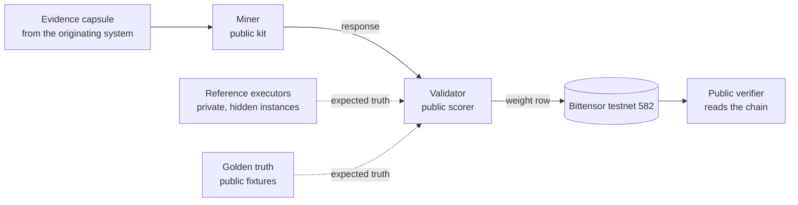

<p align="center"></p>

<p align="center">
  <a href="https://github.com/provenonce-ai/sn87-provenonce-public/actions/workflows/conformance.yml"></a>
  <a href="LICENSE"></a>
  
  
</p>

**The run succeeded. Was it right?**

SN87 is a Bittensor subnet where miners test the difference between observed autonomous work and
a declared assurance contract, for eligible structured workflows and their evidence. This is
Proof of Assurance: each miner returns one Differential, and a validator checks it.

Provenonce and Bitstarter.ai are partnering on Proof of Assurance (Bittensor Subnet 87).
Site: <https://provenonce.ai/sn87/>. Whitepaper: <https://provenonce.ai/sn87/whitepaper/>.

## Work in public

<!-- BEGIN STATUS:work_in_public -->
SN87 is live on Bittensor testnet 582. The validator's first recorded set-weights row (First Light) was applied at block 8,102,381. The attested series is 21 runs in attestation 02: it starts with `r5-20261005-a` at block 8,152,574, and its latest run, `r5-20261006-e`, landed at block 8,160,152. The code is open under the MIT License, and anyone can check the chain proof themselves with the public verifier below.
<!-- END STATUS:work_in_public -->

## 60-second quickstart

Python 3.12+ and [uv](https://docs.astral.sh/uv/) are the only requirements.

```bash
git clone https://github.com/provenonce-ai/sn87-provenonce-public && cd sn87-provenonce-public
uv sync --locked --extra transport
uv run sn87-provenonce demo
```

The demo runs the `institution/0.2` path, the one every weight uses. For each of three public
synthetic fixtures (`stale_authority`, `fresh_review`, `incomplete`) it builds a capsule with the
public generator, sends the canonical capsule bytes to the public miner method, takes the
canonical response bytes back, and scores them with the public scorer against the truth
published in `src/sn87_provenonce/institutional_v02/public_fixture_truth.json`. It prints one
row per case. `uv run sn87-provenonce demo --json` prints the same result as JSON.

What it shows: the capsule contract, a miner answering over the same bytes
[`scripts/miner_serve.py`](scripts/miner_serve.py) carries over localhost HTTP, and the scorer's
row. What it does not show: the signed transport, the chain, or hidden instances. It is local and
offline, the wire bytes are unsigned, the fixtures are public and synthetic, and the six
integrity predicates are asserted true rather than verified. The truth for these fixtures is
published; the reference executors that computed it are not, so you can check scoring against the
truth but not regenerate it here. The same holds for every committed public fixture, in
[`protocol/golden_truth/`](protocol/golden_truth).

The older `v0alpha1` demo is still available as `uv run sn87-provenonce demo --legacy-v0alpha1`.
It is research code on no weight path, and it fixes its signature, nonce, policy and evidence
checks to true.

To check the chain proof, run the verifier (next section). To serve a miner, see
[Run a miner](#run-a-miner).

## Supported platforms

Linux and macOS are supported and tested in CI (Python 3.12 and 3.13). Windows is supported
through WSL2. Native Windows is not supported. Evidence bundles open every directory and file
through a descriptor with `O_DIRECTORY` and `O_NOFOLLOW`, so a symbolic link swapped in while a
bundle is read or written cannot redirect it. Native Windows has no equivalent, and the code
fails closed there ("unsupported on this platform") instead of falling back to path checks
that a concurrent link swap can defeat. The verifier also looks up the real home directory
through the `pwd` database, which native Windows lacks. On the verifier, bundle and CLI import path, `pwd` is imported only where it is used, so
importing them does not fail on any platform.

## Verify the chain proof yourself

[attestation/](attestation) holds two self-digested lists of completed testnet runs (no
signatures, no keys): for each, the block in which the validator set
weights on netuid 582 and the row it set. The checker reads the chain and compares:

```bash
uv run --extra transport python scripts/verify_attestation.py
```

It needs the public testnet node and nothing else: no wallet, no key, no account. It runs under
a throwaway home directory and cannot send anything to the chain. Each check ends in PASS (ran,
claim holds), FAIL (ran, claim does not hold) or UNVERIFIED (could not run here, nothing claimed).

Real output, trimmed. Generated by `scripts/render_verifier_output.py`, which runs the verifier
and rewrites this block; `--check` recomputes the offline lines (no network):

<!-- BEGIN VERIFIER_OUTPUT -->
```
integrity  PASS  digest recomputes (sha256:57af3c99d683fd3c868bfe6cbcc3353451fab70f70c2a374c0eec11a9c552b7a)
published truth: 75 cases in 2 files under protocol/golden_truth, digest sha256:5fadbfcc983f7b9fb8ff1d8595e8c5dc05ae910299d6549e5347bfe805f80353
  validator  PASS  validator pinned digest recomputes from published truth and the public scorer (seed 0, 2026-10-04T00:00:00Z; sha256:6a03fa60322 ...
  plan       UNVERIFIED  UNVERIFIED: the plan document is built by Provenonce-private operator tooling from files that are not published
reproduces offline: UNVERIFIED  (22 PASS / 0 FAIL / 21 UNVERIFIED of 43 checks: integrity + plan and validator for 21 runs)
run r5-20261005-a  block 8152574  PASS  uid 0 set weights in exactly block 8152574 (LastUpdate 8102381 at block 8152573, 8152574 at block 8152574) ...
chain corroboration: PASS  (21 PASS / 0 FAIL / 0 UNVERIFIED of 21 runs)
OVERALL UNVERIFIED: 0/21 runs PASS, 0 FAIL, 21 UNVERIFIED
SUMMARY integrity: PASS; chain: 21/21 PASS; scoring: validator 21/21 PASS; plan 0/21 PASS, 21 UNVERIFIED (the plan document is built by Provenonce-private operator tooling from files that are not published)
exit code 3 (0 = PASS, 1 = FAIL, 3 = UNVERIFIED)
```
<!-- END VERIFIER_OUTPUT -->

How to read it. The integrity, validator and chain checks run from public inputs. The validator
check recomputes the pinned validator digest in process, from the published per-case truth for the
committed public fixtures ([`protocol/golden_truth/`](protocol/golden_truth)) and the public
scorer, with no reference executor; it is PASS when the digest equals the attested one and FAIL
when it does not. The plan check stays UNVERIFIED outside Provenonce: the plan digest covers a
plan document built by Provenonce-private operator tooling from files that are not published, so
it is not computed here and not claimed. One UNVERIFIED check keeps the overall verdict
UNVERIFIED. Exit codes: 0 = PASS, 1 = FAIL, 3 = UNVERIFIED.
[attestation/README.md](attestation/README.md) lists what the checker proves and what it does not.

### Which methods hold uids 1 and 2

The attested weight rows name uids 1 and 2 only; a row names uids, not methods. The table below
says which method each uid stands for, when, and on what basis. It is generated from data (see the note in the block), not typed.

<!-- BEGIN UID_TABLE -->
Testnet netuid 582, mechanism 0. Generated by `scripts/render_uid_table.py` from `attestation/TESTNET_582_PARTICIPANTS.json`; `--check` fails if this table drifts from that file or from the attestation.

| uid | hotkey | method | role | from block | weight row | basis for the method |
| --- | --- | --- | --- | --- | --- | --- |
| 0 | `5H6U3sdsYP4c27VuVvQ1JbfVyCWPHjeqiifHBHHXgj5vccjw` | none (validator) | validator | not recorded | not applicable | not applicable |
| 1 | `5CFoMvioksya5AYP9WAKRptwQR7tgtcKPhwcb6W79UbYaLPF` | `state_machine` | reference | 8,102,381 | First Light row | First Light weight row and run record |
| 1 | `5CFoMvioksya5AYP9WAKRptwQR7tgtcKPhwcb6W79UbYaLPF` | `approval_witness` | candidate | 8,152,574 | attested runs (attestation 01 and 02) | private naming binding; not verifiable from public files |
| 2 | `5GusuV1QhzkX22zjAGrBE29ybEQqF2aj84ooDYv7JJeo8TsC` | `relational` | reference | 8,102,381 | First Light row | First Light weight row and run record |
| 2 | `5GusuV1QhzkX22zjAGrBE29ybEQqF2aj84ooDYv7JJeo8TsC` | `baseline_miner` | baseline | 8,152,574 | attested runs (attestation 01 and 02) | private naming binding; not verifiable from public files |

- The same two hotkeys hold uids 1 and 2 throughout. What differs between the two periods is which methods the weight row is said to name for those uids.
- A weight row names uids, not methods. The attestation files carry only the uids (1 and 2, 65535 each). For the attested runs, the method behind each uid comes from a naming binding that Provenonce records privately; it is not independently verifiable from public files, and its approval is not citable here. It is a naming choice, not an identity proof: nothing shows that a process behind either hotkey runs the method named for it.
- The block at which each hotkey was registered is not recorded in this repository. The from block is the first block at which a weight row naming the uid is recorded.
- `state_machine`: Provenonce reference algorithm; also computes truth.
- `relational`: Provenonce reference algorithm; also computes truth.
- `approval_witness`: The replaceable Provenonce-written candidate (miners/witness_ic.py).
- `baseline_miner`: The public-contract baseline algorithm run as a miner.
<!-- END UID_TABLE -->

## How it fits together



Two assignment classes, each bound to one committed scoring profile:

| Class | Profile | Question |
|---|---|---|
| `IC-APPROVAL-APPLICABILITY` | `IC-FIRST-LIGHT-MIN-1` | Was an approval carried past a changed governing condition? |
| `TYPE-C-RELEASE` | `GRA-W03-3` | Does a release workflow trace violate its grammar? |

A miner returns one of `FINDINGS`, `NO_MATERIAL_DEVIATION` or `INSUFFICIENT_EVIDENCE_ABSTAIN`.
A validator checks the response against the wire contract, scores it with one scorer under the
committed profile, and emits a weight row or `NO_VALID_PREFERENCE_ROW`.

## Run a miner

```bash
uv sync --locked
uv run python scripts/miner_serve.py --role candidate --port 8787
curl http://127.0.0.1:8787/health      # in a second terminal
```

`miner_serve.py` serves one miner over an unsigned localhost HTTP boundary (development only):
canonical capsule bytes in, canonical response bytes out. It binds loopback only, holds no key and
writes nothing to a chain. `--role candidate` is the Provenonce-written example method
(`miners/witness_ic.py`); `--role baseline` is the matched public-contract baseline. To write your
own method, put a function with the same shape next to `witness_ic.py`, or serve it with
`sn87-miner serve --method package.module:function` (below).

The signed endpoint that validators call (`POST /v1/assurance`, `btauth/1`, shared Valkey replay
store) runs the same method with your hotkey:

```bash
uv sync --locked --extra transport
uv run sn87-miner serve --role candidate --hotkey-keyfile PATH \
  --valkey-url redis://127.0.0.1:6379/0 --check      # then without --check
```

[The miner guide](docs/guides/miner-guide.md) takes one sitting: install, write and score a method,
run the signed endpoint, sign an announcement, and see what is still missing before a score on the
test network.

[The shadow cohort page](docs/guides/shadow-cohort.md) says how an outside miner applies to be
scored and published with weight 0, and the proposed criteria for anything beyond that.

[docs/quickstart/miner.md](docs/quickstart/miner.md) shows a request against a fixture capsule,
the wire rules, the signed endpoint and how to announce it
([docs/protocol/miner-announcement.md](docs/protocol/miner-announcement.md)). Registering a hotkey
and anything on a chain is yours to do with your own wallet; this repository does not do it for
you.

## Run a validator

What is public: the wire contracts, the integrity gate, the one scorer, the committed profiles,
the evidence bundle, the signed transport, the weight quantizer, the staging validator
(`scripts/staging_subnet.py`) and the per-case truth of the committed public fixtures
(`protocol/golden_truth/`). With those you can run the staging validator on the public fixtures,
score miners against the published truth and reproduce the attested validator digest. What is
private: the reference executors, which compute truth for any capsule and so are the answer key
for hidden instances. A validator for hidden instances therefore cannot be run from this
repository alone (it also needs a source of truth for those instances, an open decision); see
[docs/quickstart/validator.md](docs/quickstart/validator.md) for what you can run and check.

## Honest limits

- Testnet only, alpha. No mainnet, production or adoption claim.
- All miners are operated by Provenonce, so the rows are conformance evidence for transport,
  integrity and arithmetic, not method competition.
- The task fixtures are illustrative.
- Scoring of the committed public fixtures is checkable here against published truth. The plan
  digest and scoring of hidden instances are not, so a public verifier run still ends UNVERIFIED
  (exit code 3, with the integrity, validator and chain checks PASS).

Read [LIMITATIONS.md](LIMITATIONS.md) before citing any result.

## What is private

The reference executors (the code that computes the expected truth) are private, and so are the
tools Provenonce uses to operate its validator. The truth they produce for the committed public
fixtures is published; the truth for any hidden instance is not. Anything that needs the private
parts is labelled "not verifiable outside Provenonce". The attestation records carry two digests
of Provenonce's output. The validator result is recomputed publicly from the published truth. The
approved plan is built by the private operator tooling, so only Provenonce can recompute it.
Benchmark supply and operations are maintained privately.

Commitments to the private executor files (SHA-256 of each file at this release; a hash of a
private file, not the file):

```
a74ac883e3c3deb912cf6107e83aed3072f3c89424fd59b6a8e54a087c31c0b1  institutional_v02/references.py
4ca7a7cc902c89bbe6f59b772cdbcad060dc04e732a3931bb07bba290214ad03  pilot/reference.py
c7b1cfc5af6b1e97da4a9cf9fac689c0adba774d6cfdf3439e678f7eee1332e4  simulation/type_c_reference.py
```

## Develop

```bash
uv sync --locked --all-extras
uv run ruff check .
uv run pytest
```

Some tests skip without the private executors; each skip says so. The scorer tests that can run
against the published truth do. CI runs the same steps
([conformance.yml](.github/workflows/conformance.yml)). See [CONTRIBUTING.md](CONTRIBUTING.md).

## Docs

- [LIMITATIONS.md](LIMITATIONS.md) and [PROVENANCE.md](PROVENANCE.md)
- [Implementation status](docs/protocol/implementation-status.md) (implemented, enabled, tested, deployed)
- [Profile application](docs/protocol/profile-application.md), [wire rules](docs/protocol/wire-rules.md), [evidence bundle](docs/protocol/evidence-bundle.md), [v0alpha1 field traceability](docs/protocol/v0alpha1-field-traceability.md)
- Quickstarts (drafts): [miner](docs/quickstart/miner.md), [validator](docs/quickstart/validator.md)
- Guides that CI runs command by command: [reviewer test guide](docs/guides/reviewer-test-guide.md); [guide format and runner](docs/protocol/guide-format.md)
- Research code, local only: [simulation](docs/simulation), [runtime](docs/runtime), [sensitivity example](examples/sensitivity/README.md)
- [Whitepaper policy](docs/whitepaper/README.md), [CHANGELOG](CHANGELOG.md)
- Decisions: [docs/architecture](docs/architecture) (ADR-0001 to ADR-0021)

## License and contact

Developed by Provenonce, Inc. under the authority of Will O'Brien, Founder & CEO.
Copyright (c) 2026 Provenonce, Inc. Licensed under the MIT License (see [LICENSE](LICENSE)).
Provenonce and Bitstarter.ai are partnering on Proof of Assurance (Bittensor Subnet 87).
Report security issues privately to ops@provenonce.co (see [SECURITY.md](SECURITY.md)).
